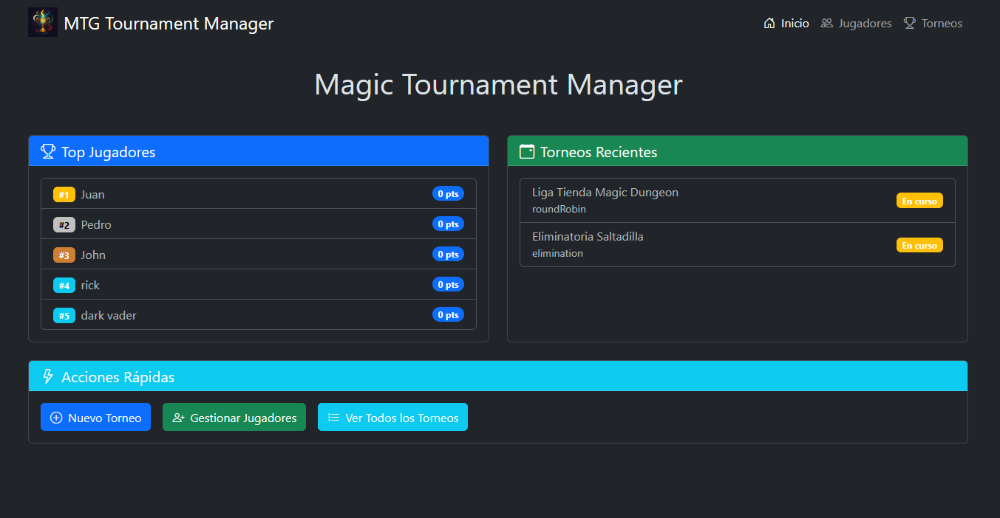
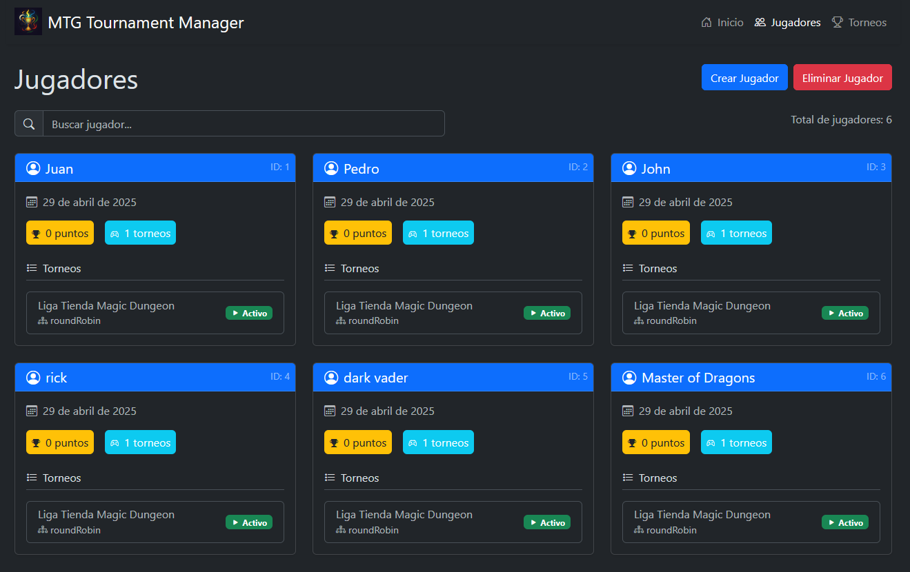
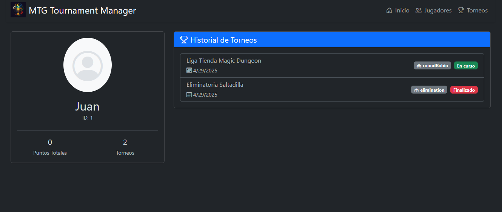
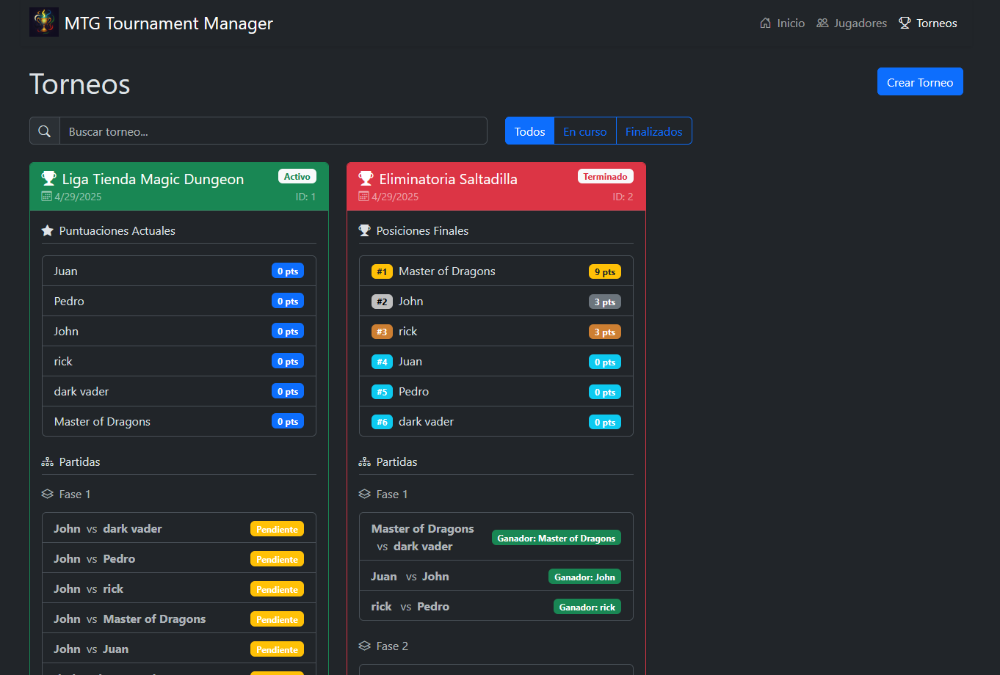
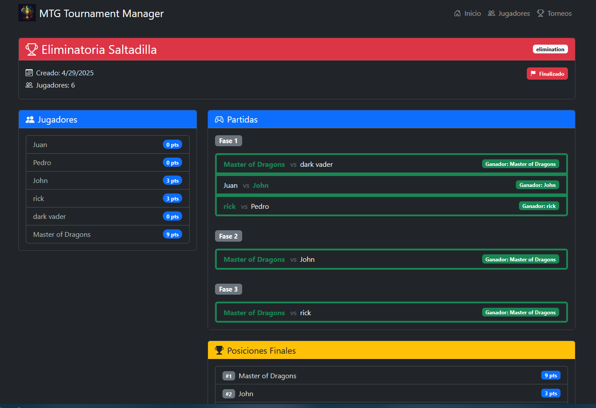

# 🪄 Magic Tournament Manager

[](https://opensource.org/licenses/MIT)
[](https://www.python.org/)
[](https://reactjs.org/)
[](https://www.typescriptlang.org/)
[](https://fastapi.tiangolo.com/)
[](https://getbootstrap.com/)

Una aplicación web moderna y completa para gestionar torneos de Magic: The Gathering, con soporte para formatos de **eliminación** y **todos contra todos**. Incluye gestión avanzada de mazos, integración con Scryfall, estadísticas detalladas y una interfaz de usuario moderna y dinámica.

## 📸 Vistas Previas

### 🏠 Página de Inicio


_Vista principal con resumen de torneos y jugadores_

### 👥 Gestión de Jugadores


_Interfaz de administración de jugadores_

### 👤 Detalle de Jugador


_Vista detallada del historial y estadísticas del jugador_

### 🏆 Detalles del Torneo


_Vista detallada de un torneo en curso_

### 🎯 Resultados de Torneo


_Visualización de posiciones finales y estadísticas_

## ✨ Características

### 🏆 Gestión de Torneos

- 📊 Crear y gestionar múltiples torneos
- 🔄 Soporte para formatos de eliminación y todos contra todos
- ⚡ Generación y emparejamiento automático de partidas
- 📈 Progresión de fases para torneos de eliminación

### 👥 Gestión de Jugadores

- 📝 Registrar y gestionar jugadores
- 📊 Seguimiento de estadísticas e historial de partidas
- 🏅 Sistema dinámico de puntuación
- 🎯 Seguimiento de rendimiento

### ⚔️ Gestión de Partidas y Mazos

- ⚡ Resultados de partidas en tiempo real
- 📜 Historial completo de partidas y mazos
- 🤝 Soporte para empates y resultados especiales
- 🔄 Generación automática de siguientes fases
- 🎴 Creación y edición de mazos con búsqueda Scryfall
- 📋 Importación de listas de mazos
- 🖼️ Visualización de cartas en tiempo real
- 📊 Estadísticas de mazos y cartas más usadas (proximanente)

## 🛠️ Tecnologías Utilizadas

### Backend

- 🐍 Python 3.13 con FastAPI 0.104.0
- 🗃️ SQLAlchemy ORM con sistema de migraciones Alembic
- 📦 Base de datos SQLite optimizada
- 🔒 Sistema de autenticación JWT
- 🎲 Algoritmos avanzados de generación de torneos
- 📊 API RESTful con documentación automática
- 🔄 Sistema de actualización en tiempo real
- 🛡️ Validación de datos con Pydantic

### Frontend

- ⚛️ React 18.2 con TypeScript 5.0
- 🎨 Bootstrap 5.3 con diseño moderno y responsivo
- 🃏 Integración con la API de Scryfall para cartas de Magic
- 🎭 Temas oscuros y efectos visuales modernos
- 🔄 Sistema de autenticación y manejo de estado
- 📊 Visualización dinámica de estadísticas
- 📱 Interfaz adaptativa para todos los dispositivos

## 🚀 Inicio Rápido

### Configuración del Backend

```bash
# Clonar el repositorio
git clone https://github.com/chapahrroh/gestor-torneos-magic.git
cd MagicTurnament/Backend

# Configurar entorno Python
python -m venv venv
source venv/bin/activate

# Instalar dependencias
pip install -r requirements.txt

# Inicializar base de datos
python models.py

# Iniciar servidor
uvicorn main:app --reload --host 0.0.0.0 --port 8000
```

### Configuración del Frontend

```bash
# Navegar al frontend
cd ../Frontend

# Instalar dependencias
npm install

# Iniciar servidor de desarrollo
npm run dev
```

## 📂 Estructura del Proyecto

```
MagicTurnament/
├── Backend/
│   ├── models.py           # Modelos de base de datos
│   ├── main.py            # Aplicación FastAPI
│   ├── schemas.py         # Esquemas Pydantic
│   ├── config.py          # Configuración de la aplicación
│   ├── matchGeneration.py # Lógica de generación de partidas
│   ├── create_db.py       # Script de creación de BD
│   ├── clearDB.py         # Utilidad de limpieza de BD
│   └── alembic/           # Sistema de migraciones
│       └── versions/      # Migraciones de base de datos
├── Frontend/
│   ├── src/
│   │   ├── api/          # Cliente API y requests
│   │   ├── components/   # Componentes React reutilizables
│   │   ├── context/     # Contextos de React (auth, etc)
│   │   ├── hooks/       # Custom hooks
│   │   ├── pages/       # Componentes de página
│   │   └── Types/       # Definiciones de tipos TypeScript
│   ├── public/          # Activos estáticos
│   └── package.json
├── DB/
│   └── database.sqlite  # Base de datos SQLite
├── preview/            # Imágenes de preview
│   ├── Home.png
│   ├── players.png
│   ├── playerdetail.png
│   ├── tournamet.png
│   └── turnamentdetail.png
└── README.md
```

## 🔌 Referencia API (Endpoints Principales)

| Endpoint                      | Método | Descripción                  |
| ----------------------------- | ------ | ---------------------------- |
| `/tournament`                 | GET    | Listar todos los torneos     |
| `/tournament/{id}`            | GET    | Obtener detalles del torneo  |
| `/tournament/{id}/next-phase` | POST   | Avanzar fase del torneo      |
| `/players/{id}/stats`         | GET    | Obtener estadísticas jugador |
| `/match/{id}/result`          | POST   | Enviar resultado de partida  |

## 🤝 Contribuir

1. Hacer fork del repositorio
2. Crear rama para tu función
   ```bash
   git checkout -b feature/nueva-funcion
   ```
3. Hacer commit de tus cambios
   ```bash
   git commit -m 'Agregar nueva función'
   ```
4. Subir la rama
   ```bash
   git push origin feature/nueva-funcion
   ```
5. Crear Pull Request

## 📝 Licencia

Este proyecto está licenciado bajo la Licencia MIT - ver el archivo [LICENSE](LICENSE) para más detalles.

---

Made with ❤️ by Chapahrroh

[⭐ Dale una estrella a este proyecto](https://github.com/chapahrroh/gestor-torneos-magic)
